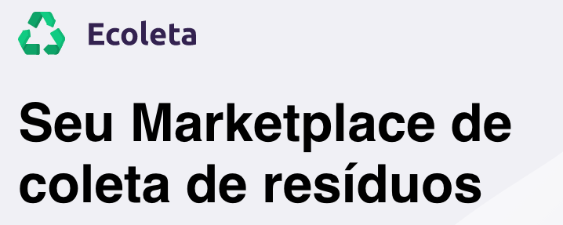
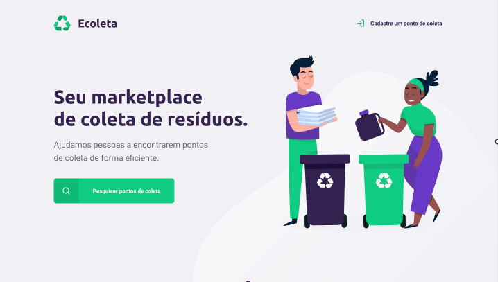
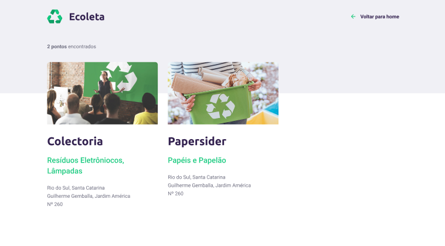

<h1 align="center">
    
</h1>

Ajudamos pessoas a encontrarem pontos de coleta de forma eficiente.

📌 Sobre o Ecoleta - Seu marketplace de coleta de resíduos.
------------------
O projeto foi ministrado por <a href="https://github.com/maykbrito">Maiky Brito</a>, instrutor da <a href="http://rocketseat.com.br">Rocketseat</a> e foi inspirado por ser a semana do ambiente. Uma semana para descobrir na prática o método que vai acelerar sua evolução e te levar para o próximo nível. 

🔧 Tecnologias utilizadas:
------------------

- <strong>JAVASCRIPT</strong>
- <strong>HTML5</strong>
- <strong>CSS3</strong>

💬 Fale comigo
------------------
[*Entre em contato comigo*](https://www.linkedin.com/in/ivo-baptista-3712144/)

Obrigado por chegar até aqui! Este projeto foi feito com muito ❤

